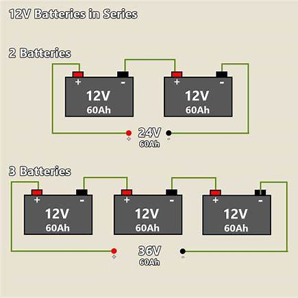
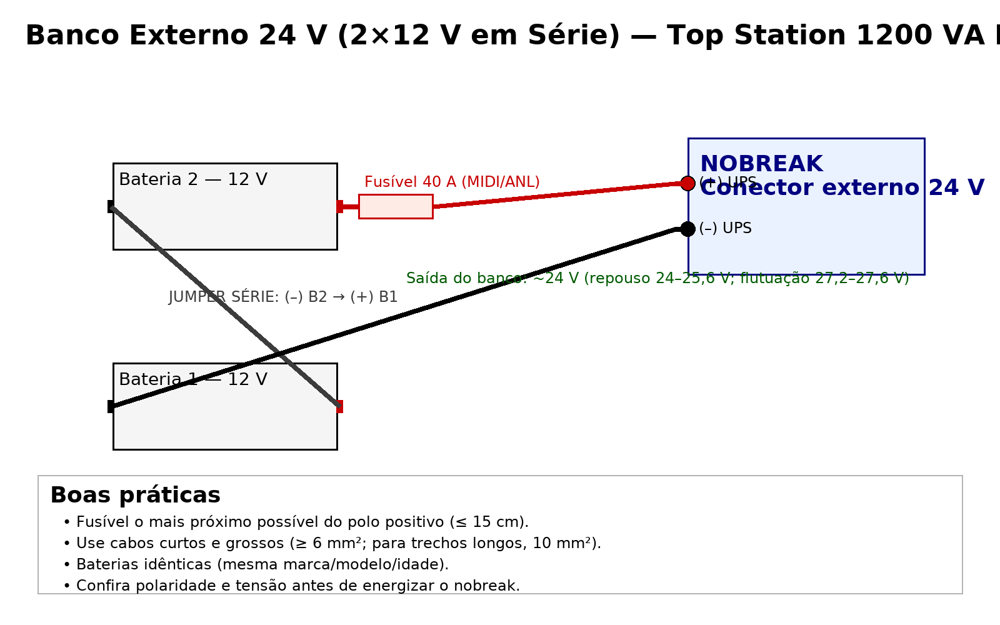

# Banco Externo 24 V no **Top Station 1200 VA Plus** (2× 12 V em série)

> Guia prático, seguro e direto ao ponto para montar um banco externo de baterias **24 V** usando **duas baterias de 12 V em série**, com fusível adequado e verificação final.

---

## Resumo

* **Objetivo:** montar um banco externo **24 V** no conector do nobreak **Top Station 1200 VA Plus**.
* **Como:** ligar **2× 12 V** em **série** + **fusível 40 A** no **positivo**, cabos curtos e grossos.
* **Por quê:** melhor **custo‑benefício** e **manutenção fácil** (2× 12 V padrão VRLA/AGM).

---

## Sumário

* [Visão geral](#visão-geral)
* [Materiais e ferramentas](#materiais-e-ferramentas)
* [Esquema de ligação (24 V)](#esquema-de-ligação-24v)
* [Passo a passo seguro](#passo-a-passo-seguro)
* [Bitola, fusível e distância](#bitola-fusível-e-distância)
* [Testes e validações](#testes-e-validações)
* [Autonomia (estimativa)](#autonomia-estimativa)
* [Troubleshooting](#troubleshooting)
* [FAQ](#faq)
* [Checklist final](#checklist-final)
* [Referências rápidas](#referências-rápidas)

---

## Visão geral

O **Top Station 1200 VA Plus** trabalha com **barramento 24 V** no conector externo. Para obter 24 V com baterias padrão, usa‑se **duas baterias 12 V** em **série**: a tensão **soma** (12 + 12 = 24 V) e a **capacidade em Ah permanece** a da bateria individual.

**Por que 2×12 V é melhor que “uma bateria 24/27 V”?**

* Monoblocos “24/27 V” não são padrão do varejo e **custam mais**.
* **2×12 V** (VRLA/AGM) são fáceis de achar, trocar e combinar **com ótimo custo‑benefício**.

> **Segurança sempre**: instale **fusível 40 A** no **positivo**, o mais **próximo possível** do polo.

---

## Materiais e ferramentas

* **Baterias:** 2× **12 V VRLA/AGM idênticas** (mesma marca/modelo/idade).
* **Fusível:** **40 A** tipo **MIDI** ou **ANL** **com porta‑fusível de parafuso** (ou **disjuntor DC 40–50 A**).
* **Cabos:** cobre **≥ 6 mm²** (até ~1 m total); para trechos mais longos, use **10 mm²**.
* **Terminais:** tipo olhal + **termorretrátil**.
* **Multímetro** (verificação de tensão e polaridade).

**Fotos/ilustrações** (clique para ampliar):

---

## Esquema de ligação (24 V)

**Série = somar tensões**. O **jumper** vai do **(–) da Bateria 2** para o **(+) da Bateria 1**.

* **(+) do nobreak** → **(+) Bateria 2** → **FUSÍVEL 40 A** (≤ 15 cm do polo)
* **(–) do nobreak** → **(–) Bateria 1**
* **JUMPER**: **(–) B2 → (+) B1**

> Antes de conectar no nobreak, meça no banco: **~24–25,6 V (repouso)** ou **~27,2–27,6 V (flutuação)**.

---

## Passo a passo seguro

1. **Desligue** o nobreak e **retire da tomada**.
2. Monte o **jumper de série**: **(–) Bateria 2 → (+) Bateria 1**.
3. Instale o **porta‑fusível** no **cabo positivo**, **a ≤ 15 cm** do polo **(+)** da Bateria 2 e insira o **fusível 40 A**.
4. Conecte **(+) do nobreak** ao **(+) da Bateria 2** (passando pelo fusível).
5. Conecte **(–) do nobreak** ao **(–) da Bateria 1**.
6. **Conferência dupla**: polaridade, aperto dos terminais, isolação e rota dos cabos.
7. **Meça a tensão** no conector externo do banco (deve estar ~24–27 V).
8. Re‑energize o nobreak e **acompanhe a carga** das baterias.

> **Nunca** ligue uma **única bateria 12 V** no conector **24 V**.

---

## Bitola, fusível e distância

* **Fusível 40 A** (MIDI/ANL) com **porta‑fusível de parafuso**. Alternativa: **disjuntor DC 40–50 A** (atua também como chave geral).
* **Cabos curtos e grossos**: **≥ 6 mm²** até ~1 m total. Se o trajeto for maior (ou a carga de pico alta), use **10 mm²**.
* **Térmica**: mantenha as baterias ventiladas e fora de fontes de calor (temperatura alta reduz vida útil de VRLA/AGM).

---

## Testes e validações

* **Repouso**: banco deve marcar **~24–25,6 V** no multímetro.
* **Flutuação (carregando)**: **~27,2–27,6 V**.
* **Queda de tensão**: sob carga, não deve cair **abaixo de ~22,5–23 V** rapidamente.
* **Aquecimento**: porta‑fusível e cabos **não** devem aquecer perceptivelmente em operação normal.

> O carregador interno do nobreak costuma ter **baixa corrente (1–3 A)**. Bancos muito grandes **demoram** a recarregar.

---

## Autonomia (estimativa)

Regra prática: **Energia útil ≈ 24 V × Ah × 0,75** (perdas). Exemplos para cargas típicas:

| Banco (série)     | Energia útil | ~100 W |  ~300 W |  ~500 W |
| ----------------- | -----------: | -----: | ------: | ------: |
| 2× 12 V **7 Ah**  |   **126 Wh** |  ~1h16 | ~25 min | ~15 min |
| 2× 12 V **9 Ah**  |   **162 Wh** |  ~1h37 | ~32 min | ~19 min |
| 2× 12 V **18 Ah** |   **324 Wh** |  ~3h14 |   ~1h05 | ~39 min |
| 2× 12 V **26 Ah** |   **468 Wh** |  ~4h41 |   ~1h34 | ~56 min |

> O Top Station 1200 VA entrega até **~720 W**; em plena carga o banco 24 V pode puxar **~30 A**.

---

## Troubleshooting

* **Nobreak não reconhece o banco**: verifique **polaridade**, **fusível aberto**, **terminais frouxos**.
* **Autonomia menor que o esperado**: baterias **desbalanceadas/antigas**, temperatura alta, **carga maior** que a estimada.
* **Aquecimento de cabos/porta‑fusível**: subdimensionamento (**use 10 mm²**), mau contato, porta‑fusível de baixa qualidade.

---

## FAQ

**Posso usar “bateria de 24/27 V” única?** Sim, mas **raras e caras**; **2×12 V** é mais prático e barato.

**Fusível automotivo comum serve?** Prefira **MIDI/ANL** (parafuso). Lâmina ATO funciona em baixa corrente, porém **dissipa menos**. **Disjuntor DC 40–50 A** é alternativa com chaveamento.

**Posso misturar 12 V 7 Ah com 12 V 9 Ah?** Evite. Use **idênticas**.

---

## Checklist final

* [ ] Baterias **idênticas** (12 V VRLA/AGM) e em **bom estado**.
* [ ] **Jumper série**: (–) **B2** → (+) **B1**.
* [ ] **Fusível 40 A** no **positivo**, ≤ 15 cm do polo.
* [ ] Cabos **≥ 6 mm²** (ou **10 mm²** se trajeto > 1 m).
* [ ] Tensão do banco conferida (**~24–27 V**).
* [ ] Terminais apertados e isolados; rota sem abrasão.

---

## Referências rápidas

* Conector externo: **24 V** (conforme especificação do Top Station 1200 VA Plus).
* Tensão típica: **repouso 24–25,6 V**, **flutuação 27,2–27,6 V**.
* Fusível recomendado: **40 A (MIDI/ANL)** ou **disjuntor DC 40–50 A**.

---

**Criado por Jeferson Salles**
LinkedIn: [https://www.linkedin.com/in/jmsalles/](https://www.linkedin.com/in/jmsalles/)
E-mail: [jefersonmattossalles@gmail.com](mailto:jefersonmattossalles@gmail.com)
GitHub: [https://github.com/jmsalles](https://github.com/jmsalles)
