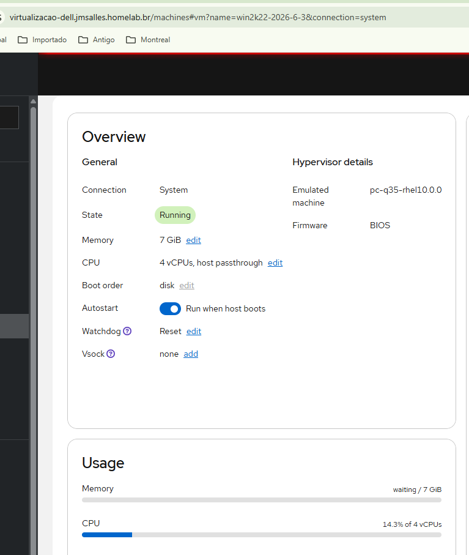
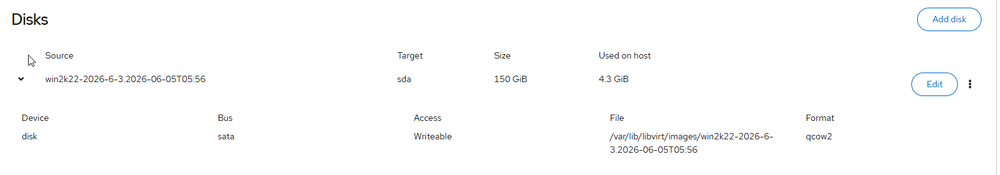

Dell  192.168.31.38

Roda a 
vm AD 192.168.31.24
Uso atual de Memoria 6G

[root@dell jmsalles]# df -hT
Sist. Arq.          Tipo      Tam. Usado Disp. Uso% Montado em
/dev/mapper/rl-root ext4      757G   52G  667G   8% /
devtmpfs            devtmpfs  4,0M     0  4,0M   0% /dev
tmpfs               tmpfs      16G     0   16G   0% /dev/shm
efivarfs            efivarfs  256K   83K  169K  34% /sys/firmware/efi/efivars
tmpfs               tmpfs     6,2G   26M  6,2G   1% /run
tmpfs               tmpfs     1,0M     0  1,0M   0% /run/credentials/systemd-journald.service
/dev/mapper/rl-home ext4      141G  464K  134G   1% /home
/dev/nvme0n1p2      xfs       960M  332M  629M  35% /boot
/dev/nvme0n1p1      vfat      599M  8,4M  591M   2% /boot/efi
tmpfs               tmpfs     3,1G   76K  3,1G   1% /run/user/42
tmpfs               tmpfs     3,1G  104K  3,1G   1% /run/user/1000
[root@dell jmsalles]# fdisk -l
Disk /dev/nvme0n1: 931,51 GiB, 1000204886016 bytes, 1953525168 sectors
Disk model: SanDisk SSD Plus 1TB A3N
Units: sectors of 1 * 512 = 512 bytes
Sector size (logical/physical): 512 bytes / 512 bytes
I/O size (minimum/optimal): 512 bytes / 512 bytes
Disklabel type: gpt
Disk identifier: 53466BF8-CDBE-4D58-8B1B-3E996B1458E5

Device           Start        End    Sectors   Size Type
/dev/nvme0n1p1    2048    1230847    1228800   600M EFI System
/dev/nvme0n1p2 1230848    3327999    2097152     1G Linux extended boot
/dev/nvme0n1p3 3328000 1953523711 1950195712 929,9G Linux LVM

Disk /dev/mapper/rl-root: 770 GiB, 826781204480 bytes, 1614807040 sectors
Units: sectors of 1 * 512 = 512 bytes
Sector size (logical/physical): 512 bytes / 512 bytes
I/O size (minimum/optimal): 512 bytes / 512 bytes

Disk /dev/mapper/rl-swap: 15,64 GiB, 16793993216 bytes, 32800768 sectors
Units: sectors of 1 * 512 = 512 bytes
Sector size (logical/physical): 512 bytes / 512 bytes
I/O size (minimum/optimal): 512 bytes / 512 bytes

Disk /dev/mapper/rl-home: 144,28 GiB, 154920812544 bytes, 302579712 sectors
Units: sectors of 1 * 512 = 512 bytes
Sector size (logical/physical): 512 bytes / 512 bytes
I/O size (minimum/optimal): 512 bytes / 512 bytes
[root@dell jmsalles]# vgs
  VG #PV #LV #SN Attr   VSize   VFree
  rl   1   3   0 wz--n- 929,92g    0
[root@dell jmsalles]#